# Diagrams

These diagrams are aligned with the current Java code. Use case names intentionally reference the real methods/classes that implement them.

## Use Case Diagram

```mermaid
flowchart LR
    BaseUser((User))
    EmployeeActor((Employee))
    StudentActor((Student))
    TeacherActor((Teacher))
    ManagerActor((Manager))
    AdminActor((Admin))
    SupportActor((TechSupportSpecialist))
    ResearcherActor((Researcher))
    JournalActor((Journal subscriber))
    DemoActor((Main demo))

    AuthLogin[User.login / AuthenticationService.login]
    AuthLogout[User.logout / AuthenticationService.logout]
    ChangePassword[User.changePassword]
    SwitchLanguage[User.switchLanguage]
    SendMessage[Employee.sendMessage]
    ViewMessages[Employee.viewMessages]

    RegisterCourse[Student.registerCourse]
    DropCourse[Student.dropCourse]
    ViewMarks[Student.viewMarks]
    ViewTranscript[Student.viewTranscript / getTranscript]
    ViewTeacherInfo[Student.viewTeacherInfo]
    RateTeacher[Student.rateTeacher]
    JoinOrganization[Student.joinOrganization]

    ManageCourse[Teacher.manageCourse]
    PutMark[Teacher.putMark]
    ViewStudents[Teacher.viewStudents]
    ViewStudentInfo[Teacher.viewStudentInfo]
    SendComplaint[Teacher.sendComplaint]

    AddStudent[Manager.addStudent]
    AddTeacher[Manager.addTeacher]
    AssignCourse[Manager.assignCourseToTeacher]
    ApproveRegistration[Manager.approveRegistration]
    AddCourseRegistration[Manager.addCourseForRegistration]
    GenerateReport[Manager.generateStatisticalReport]
    ManageNews[Manager.manageNews]
    ViewAllStudents[Manager.viewAllStudents]
    ViewAllTeachers[Manager.viewAllTeachers]
    ViewRequests[Manager.viewRequests]

    AddUser[Admin.addUser]
    RemoveUser[Admin.removeUser]
    UpdateUser[Admin.updateUser]
    ViewLogs[Admin.viewLogFiles / getUserLogs]
    SystemReport[Admin.generateSystemReport]

    SupportView[TechSupportSpecialist.viewRequests]
    AcceptRequest[TechSupportSpecialist.acceptRequest]
    RejectRequest[TechSupportSpecialist.rejectRequest]
    DoneRequest[TechSupportSpecialist.markRequestDone]
    UpdateRequest[TechSupportSpecialist.updateRequestStatus]
    ExecuteRequestCommand[CommandInvoker.execute / RequestStatusCommand.execute]

    CalculateHIndex[Researcher.calculateHIndex]
    PrintPapers[Researcher.printPapers]
    PublishPaper[Researcher.publishPaper]
    JoinProject[Researcher.joinProject]
    AddParticipant[ResearchProject.addParticipant]
    PaperCitation[ResearchPaper.getCitation]
    SortResearch[ResearchAnalytics.sortPapers / topCitedResearchers]
    AllResearchPapers[ResearchAnalytics.allResearchPapers / printAllResearchPapers]
    StrategySort[SortingUtils.sort / SortingStrategy.sort]

    Subscribe[Journal.subscribe]
    Unsubscribe[Journal.unsubscribe]
    PublishToJournal[Journal.publishPaper]
    ObserverNotify[Journal.notifyObservers]
    NewsFromPaper[NewsGenerator.createFromPaper]
    TopResearcherNews[NewsGenerator.createTopResearcherNews]

    MarkAttendance[AttendanceService.markAttendance]
    AttendanceRate[AttendanceService.calculateAttendanceRate]
    AttendanceByStudent[AttendanceService.getRecordsForStudent]
    AttendanceByLesson[AttendanceService.getRecordsForLesson]

    SaveStorage[DataStorage.save]
    LoadStorage[DataStorage.load]

    BaseUser --> AuthLogin
    BaseUser --> AuthLogout
    BaseUser --> ChangePassword
    BaseUser --> SwitchLanguage

    EmployeeActor --> SendMessage
    EmployeeActor --> ViewMessages

    StudentActor --> RegisterCourse
    StudentActor --> DropCourse
    StudentActor --> ViewMarks
    StudentActor --> ViewTranscript
    StudentActor --> ViewTeacherInfo
    StudentActor --> RateTeacher
    StudentActor --> JoinOrganization

    TeacherActor --> ManageCourse
    TeacherActor --> PutMark
    TeacherActor --> ViewStudents
    TeacherActor --> ViewStudentInfo
    TeacherActor --> SendComplaint

    ManagerActor --> AddStudent
    ManagerActor --> AddTeacher
    ManagerActor --> AssignCourse
    ManagerActor --> ApproveRegistration
    ManagerActor --> AddCourseRegistration
    ManagerActor --> GenerateReport
    ManagerActor --> ManageNews
    ManagerActor --> ViewAllStudents
    ManagerActor --> ViewAllTeachers
    ManagerActor --> ViewRequests

    AdminActor --> AddUser
    AdminActor --> RemoveUser
    AdminActor --> UpdateUser
    AdminActor --> ViewLogs
    AdminActor --> SystemReport

    SupportActor --> SupportView
    SupportActor --> AcceptRequest
    SupportActor --> RejectRequest
    SupportActor --> DoneRequest
    SupportActor --> UpdateRequest
    SupportActor --> ExecuteRequestCommand

    ResearcherActor --> CalculateHIndex
    ResearcherActor --> PrintPapers
    ResearcherActor --> PublishPaper
    ResearcherActor --> JoinProject
    ResearcherActor --> AddParticipant
    ResearcherActor --> PaperCitation
    ResearcherActor --> SortResearch
    ResearcherActor --> AllResearchPapers
    ResearcherActor --> StrategySort

    JournalActor --> Subscribe
    JournalActor --> Unsubscribe
    JournalActor --> PublishToJournal
    JournalActor --> ObserverNotify
    JournalActor --> NewsFromPaper
    JournalActor --> TopResearcherNews

    DemoActor --> MarkAttendance
    DemoActor --> AttendanceRate
    DemoActor --> AttendanceByStudent
    DemoActor --> AttendanceByLesson
    DemoActor --> SaveStorage
    DemoActor --> LoadStorage
```



## Class Diagram

```mermaid
classDiagram
    class Serializable {
        <<interface>>
    }

    class User {
        -String id
        -String fullName
        -String email
        -String password
        -String language
        -boolean loggedIn
        +User(String, String, String, String, String)
        +getId() String
        +getFullName() String
        +getEmail() String
        +getPassword() String
        +getLanguage() String
        +login(String, String) boolean
        +logout() void
        +changePassword(String) void
        +switchLanguage(Language) void
        +isLoggedIn() boolean
        +toString() String
        +equals(Object) boolean
        +hashCode() int
    }

    class Employee {
        -double salary
        -Date hireDate
        -String employeeId
        -List~Message~ messages
        +Employee(String, String, String, String, String, double, Date, String)
        +sendMessage(Employee, String) void
        +viewMessages() List~Message~
        +getSalary() double
        +getEmployeeId() String
    }

    class Admin {
        -List~String~ logFiles
        -List~User~ users
        -List~UserLog~ userLogs
        +Admin(String, String, String, String, String, double, Date, String)
        +addUser(User) void
        +removeUser(String) void
        +updateUser(User) void
        +viewLogFiles() List~String~
        +generateSystemReport() String
        +getUserLogs() List~UserLog~
    }

    class Manager {
        -ManagerType managerType
        -String department
        -List~Student~ students
        -List~Teacher~ teachers
        -List~Request~ requests
        +Manager(String, String, String, String, String, double, Date, String, ManagerType, String)
        +addStudent(Student) void
        +addTeacher(Teacher) void
        +assignCourseToTeacher(Course, Teacher, LessonType) void
        +assignCourseToTeacher(Course, Teacher) void
        +approveRegistration(Student, Course) boolean
        +addCourseForRegistration(Course, int, String) void
        +generateStatisticalReport() Report
        +manageNews(News, String) void
        +viewAllStudents(SortBy) List~Student~
        +viewAllTeachers() List~Teacher~
        +viewRequests() List~Request~
    }

    class TechSupportSpecialist {
        -List~Request~ requests
        +TechSupportSpecialist(String, String, String, String, String, double, Date, String)
        +viewRequests() List~Request~
        +acceptRequest(Request) void
        +rejectRequest(Request, String) void
        +markRequestDone(Request) void
        +updateRequestStatus(Request, RequestStatus) void
    }

    class Teacher {
        -String teacherId
        -TeacherPosition position
        -List~Course~ taughtCourses
        -List~ResearchPaper~ researchPapers
        -List~ResearchProject~ researchProjects
        +Teacher(String, String, String, String, String, double, Date, String, String, TeacherPosition, List~Course~)
        +getTeacherId() String
        +getPosition() TeacherPosition
        +getTaughtCourses() List~Course~
        +putMark(Student, Course, Mark) void
        +manageCourse(Course) void
        +viewStudents(Course) List~Student~
        +sendComplaint(Student, UrgencyLevel, String) void
        +viewStudentInfo(Student) String
        +equals(Object) boolean
        +hashCode() int
        +toString() String
        +calculateHIndex() int
        +printPapers(Comparator~ResearchPaper~) void
        +getResearchProjects() List~ResearchProject~
        +getResearchPapers() List~ResearchPaper~
        +publishPaper(ResearchPaper) void
        +joinProject(ResearchProject) void
    }

    class ResearchEmployee {
        -List~ResearchPaper~ researchPapers
        -List~ResearchProject~ researchProjects
        +ResearchEmployee(String, String, String, String, String, double, Date, String)
        +calculateHIndex() int
        +printPapers(Comparator~ResearchPaper~) void
        +getResearchProjects() List~ResearchProject~
        +getResearchPapers() List~ResearchPaper~
        +publishPaper(ResearchPaper) void
        +joinProject(ResearchProject) void
    }

    class Student {
        -String studentId
        -String major
        -int yearOfStudy
        -double gpa
        -int credits
        -List~Course~ enrolledCourses
        -List~Mark~ marks
        +Student(String, String, String, String, String, String, String, int, double, int, List~Course~, List~Mark~)
        +getStudentId() String
        +getMajor() String
        +getYearOfStudy() int
        +getGpa() double
        +getCredits() int
        +getEnrolledCourses() List~Course~
        +getMarks() List~Mark~
        +registerCourse(Course) boolean
        +dropCourse(Course) boolean
        +viewMarks() List~Mark~
        +viewTranscript() Transcript
        +rateTeacher(Teacher, int) void
        +getTranscript() Transcript
        +viewTeacherInfo(Course, LessonType) String
        +joinOrganization(Organization) void
        +toString() String
        +equals(Object) boolean
        +hashCode() int
    }

    class GraduateStudent {
        -String thesisTitle
        -Researcher supervisor
        -List~ResearchPaper~ publishedPapers
        -List~ResearchProject~ researchProjects
        +GraduateStudent(String, String, String, String, String, String, String, int, double, int, List~Course~, List~Mark~, String, Researcher)
        +defendThesis() boolean
        +getSupervisor() Researcher
        +setSupervisor(Researcher) void
        +calculateHIndex() int
        +printPapers(Comparator~ResearchPaper~) void
        +getResearchProjects() List~ResearchProject~
        +getResearchPapers() List~ResearchPaper~
        +publishPaper(ResearchPaper) void
        +joinProject(ResearchProject) void
    }

    class MasterStudent {
        -int courseWorkCredits
        +MasterStudent(String, String, String, String, String, String, String, int, double, int, List~Course~, List~Mark~, String, Researcher, int)
        +getCourseWorkCredits() int
    }

    class PhDStudent {
        -String dissertationTopic
        -List~ResearchPaper~ publicationsRequired
        +PhDStudent(String, String, String, String, String, String, String, int, double, int, List~Course~, List~Mark~, String, Researcher, String, List~ResearchPaper~)
        +getDissertationTopic() String
        +getPublicationsRequired() List~ResearchPaper~
    }

    class Course {
        -String courseId
        -String title
        -int credits
        -String major
        -int yearOfStudy
        -CourseType courseType
        -Teacher lectureTeacher
        -Teacher practiceTeacher
        -List~Student~ enrolledStudents
        -List~Lesson~ lessons
        +Course(String, String, int, String, int, CourseType)
        +Course()
        +getCourseId() String
        +getTitle() String
        +getCredits() int
        +getMajor() String
        +getYearOfStudy() int
        +getCourseType() CourseType
        +getLectureTeacher() Teacher
        +getPracticeTeacher() Teacher
        +getEnrolledStudents() List~Student~
        +getLessons() List~Lesson~
        +setLectureTeacher(Teacher) void
        +setPracticeTeacher(Teacher) void
        +addStudent(Student) boolean
        +removeStudent(Student) boolean
        +getAvailableSeats() int
        +getTeacherForLessonType(LessonType) Teacher
        +addLesson(Lesson) boolean
        +removeLesson(Lesson) boolean
        +toString() String
    }

    class Lesson {
        -String lessonId
        -LessonType type
        -Date date
        -String time
        -String room
        -Course course
        -Teacher teacher
        +Lesson(String, LessonType, Date, String, String, Course, Teacher)
        +getLessonId() String
        +getType() LessonType
        +getDate() Date
        +getTime() String
        +getRoom() String
        +getCourse() Course
        +getTeacher() Teacher
        +getLessonInfo() String
        +toString() String
    }

    class Mark {
        -double firstAttestation
        -double secondAttestation
        -double finalExam
        -double total
        -String letterGrade
        -Course course
        -Student student
        +Mark(double, double, double)
        +getTotal() double
        +getLetterGrade() String
        +getCourse() Course
        +getStudent() Student
        +calculateTotal() double
        +calculateLetterGrade() String
        +toString() String
    }

    class Transcript {
        -Student student
        -Map~Course, Mark~ marks
        -double gpa
        -Date generatedDate
        +Transcript(Student, Map~Course, Mark~, double, Date)
        +Transcript(Student)
        +addMark(Course, Mark) void
        +calculateGPA() double
        +printTranscript() void
    }

    class TeacherRating {
        -Student student
        -Teacher teacher
        -int rating
        -Date date
        -List~TeacherRating~ ratings
        +TeacherRating(Student, Teacher, int, Date)
        +addRating(Student, Teacher, int) void
        +getRating(Teacher) double
    }

    class AttendanceRecord {
        -Student student
        -Lesson lesson
        -AttendanceStatus status
        -Date recordedAt
        +AttendanceRecord(Student, Lesson, AttendanceStatus)
        +getStudent() Student
        +getLesson() Lesson
        +getStatus() AttendanceStatus
        +getRecordedAt() Date
        +updateStatus(AttendanceStatus) void
        +countsAsAttended() boolean
        +toString() String
    }

    class AttendanceService {
        -List~AttendanceRecord~ records
        +markAttendance(Student, Lesson, AttendanceStatus) AttendanceRecord
        +getRecordsForStudent(Student) List~AttendanceRecord~
        +getRecordsForLesson(Lesson) List~AttendanceRecord~
        +calculateAttendanceRate(Student) double
        +getAllRecords() List~AttendanceRecord~
    }

    class Researcher {
        <<interface>>
        +calculateHIndex() int
        +printPapers(Comparator~ResearchPaper~) void
        +getResearchProjects() List~ResearchProject~
        +getResearchPapers() List~ResearchPaper~
        +publishPaper(ResearchPaper) void
        +joinProject(ResearchProject) void
    }

    class ResearchPaper {
        -String title
        -List~String~ authors
        -String journal
        -int citations
        -int pages
        -Date publicationDate
        -String doi
        +ResearchPaper(String, List~String~, String, int, int, Date, String)
        +getTitle() String
        +getCitations() int
        +getPublicationDate() Date
        +getAuthors() List~String~
        +getPages() int
        +getCitation(Format) String
        +compareTo(ResearchPaper) int
    }

    class ResearchProject {
        -String topic
        -List~ResearchPaper~ publishedPapers
        -List~Researcher~ participants
        -Date startDate
        -Date endDate
        +ResearchProject(String, Date, Date)
        +getTopic() String
        +setTopic(String) void
        +getPublishedPapers() List~ResearchPaper~
        +getParticipants() List~Researcher~
        +addPaper(ResearchPaper) void
        +addParticipant(Researcher) boolean
        +addParticipant(Object) boolean
    }

    class ResearchAnalytics {
        +topCitedResearchers(List~Researcher~, int) List~Researcher~
        +papersByYear(List~ResearchPaper~, int) List~ResearchPaper~
        +sortPapers(List~ResearchPaper~, Comparator~ResearchPaper~) List~ResearchPaper~
        +printPapers(List~ResearchPaper~, Comparator~ResearchPaper~) void
        +allResearchPapers(List~Researcher~) List~ResearchPaper~
        +printAllResearchPapers(List~Researcher~, Comparator~ResearchPaper~) void
        +topCitedResearcherOfYear(List~Researcher~, int) Researcher
    }

    class HIndexCalculator {
        +calculate(List~ResearchPaper~) int
    }

    class News {
        -NewsType type
        -String title
        -String content
        -Date date
        -List~Comment~ comments
        -boolean pinned
        +News(String, String, NewsType)
        +addComment(Comment) void
        +pin() void
        +getTitle() String
    }

    class NewsGenerator {
        +createFromPaper(ResearchPaper) News
        +createTopResearcherNews(User) News
    }

    class Comment {
        -String text
        -User author
        +Comment(String, User)
        +getText() String
    }

    class Journal {
        -String name
        -List~User~ subscribers
        -List~Observer~ observers
        +Journal(String)
        +subscribe(User) void
        +unsubscribe(User) void
        +publishPaper(ResearchPaper) void
        +addObserver(Observer) void
        +removeObserver(Observer) void
        +notifyObservers(String) void
    }

    class Observable {
        <<interface>>
        +addObserver(Observer) void
        +removeObserver(Observer) void
        +notifyObservers(String) void
    }

    class Observer {
        <<interface>>
        +update(String) void
    }

    class Message {
        -User sender
        -User receiver
        -String text
        -Date date
        +Message(User, User, String)
        +getText() String
        +getSender() User
        +getReceiver() User
        +getDate() Date
        +toString() String
    }

    class OfficialMessage {
        -String subject
        -Date eventDate
        -String room
        +OfficialMessage(User, User, String, String, Date, String)
        +getSubject() String
        +getEventDate() Date
        +getRoom() String
        +toString() String
    }

    class MessageService {
        +sendMessage(User, User, String) void
    }

    class Subscription {
        -User user
        -Journal journal
        +Subscription(User, Journal)
        +getUser() User
        +getJournal() Journal
    }

    class Request {
        -String requestId
        -String description
        -User requester
        -RequestStatus status
        -Date createdDate
        -Date resolvedDate
        +Request(String, String, User)
        +getStatus() RequestStatus
        +updateStatus(RequestStatus) void
        +getRequestInfo() String
    }

    class Organization {
        -String orgId
        -String name
        -Student head
        -List~Student~ members
        +Organization(String, String)
        +addMember(Student) void
        +removeMember(Student) void
        +electHead(Student) void
        +setHead(Student) void
    }

    class RoomBooking {
        -String room
        -String date
        +RoomBooking(String, String)
    }

    class Report {
        -String title
        -String content
        +Report(String, String)
        +getTitle() String
        +getContent() String
        +toString() String
    }

    class AbstractReportGenerator {
        <<abstract>>
        +generate() Report
    }

    class AcademicPerformanceReportGenerator {
        -List~Student~ students
        +AcademicPerformanceReportGenerator(List~Student~)
        +generate() Report
    }

    class UserLog {
        -Date timestamp
        -String actorId
        -String action
        +UserLog(String, String)
        +getTimestamp() Date
        +getActorId() String
        +getAction() String
        +toString() String
    }

    class AuthenticationService {
        -User currentUser
        +login(User, String, String) boolean
        +logout() void
        +getCurrentUser() User
    }

    class DataStorage {
        -DataStorage instance
        -List~User~ users
        -List~Course~ courses
        -List~ResearchPaper~ researchPapers
        -List~ResearchProject~ researchProjects
        +getInstance() DataStorage
        +getUsers() List~User~
        +getCourses() List~Course~
        +getResearchPapers() List~ResearchPaper~
        +getResearchProjects() List~ResearchProject~
        +addUser(User) void
        +addCourse(Course) void
        +addResearchPaper(ResearchPaper) void
        +addResearchProject(ResearchProject) void
        +save() void
        +save(String) void
        +load() DataStorage
        +load(String) DataStorage
    }

    class SortingUtils {
        +sortStudents(List~Student~, Comparator~Student~) List~Student~
        +sort(List~T~, SortingStrategy~T~) List~T~
    }

    class SortingStrategy {
        <<interface>>
        +sort(List~T~) List~T~
    }

    class ComparatorSortingStrategy {
        -Comparator~T~ comparator
        +ComparatorSortingStrategy(Comparator~T~)
        +sort(List~T~) List~T~
    }

    class UniversityComparators {
        +BY_GPA_DESC Comparator~Student~
        +BY_GPA_ASC Comparator~Student~
        +BY_NAME Comparator~Student~
        +BY_ID Comparator~Student~
        +TEACHER_BY_NAME Comparator~Teacher~
        +TEACHER_BY_POSITION Comparator~Teacher~
        +PAPER_BY_CITATIONS_DESC Comparator~ResearchPaper~
        +PAPER_BY_DATE_DESC Comparator~ResearchPaper~
        +PAPER_BY_PAGES_DESC Comparator~ResearchPaper~
    }

    class Command {
        <<interface>>
        +execute() void
    }

    class RequestStatusCommand {
        -TechSupportSpecialist specialist
        -Request request
        -RequestStatus status
        -String reason
        +RequestStatusCommand(TechSupportSpecialist, Request, RequestStatus)
        +RequestStatusCommand(TechSupportSpecialist, Request, RequestStatus, String)
        +execute() void
    }

    class CommandInvoker {
        -List~Command~ history
        +execute(Command) void
        +getHistory() List~Command~
    }

    class Printable {
        <<interface>>
        +printInfo() void
    }

    class Ratable {
        <<interface>>
        +addRating(double) void
        +getAverageRating() double
    }

    class NotResearcherException
    class SupervisorException

    class AttendanceStatus {
        <<enum>>
        PRESENT
        ABSENT
        LATE
        EXCUSED
    }
    class CourseType {
        <<enum>>
        MAJOR
        MINOR
        FREE_ELECTIVE
    }
    class Format {
        <<enum>>
        PLAIN_TEXT
        BIBTEX
    }
    class Language {
        <<enum>>
        KZ
        EN
        RU
    }
    class LessonType {
        <<enum>>
        LECTURE
        PRACTICE
    }
    class ManagerType {
        <<enum>>
        OR_MANAGER
        DEPARTMENT_MANAGER
        DEAN_MANAGER
    }
    class NewsType {
        <<enum>>
        RESEARCH
        NORMAL
    }
    class RequestStatus {
        <<enum>>
        PENDING
        VIEWED
        ACCEPTED
        REJECTED
        DONE
    }
    class SortBy {
        <<enum>>
        NAME
        ID
        GPA
    }
    class TeacherPosition {
        <<enum>>
        TUTOR
        LECTOR
        SENIOR_LECTOR
        PROFESSOR
    }
    class UrgencyLevel {
        <<enum>>
        LOW
        MEDIUM
        HIGH
    }
    class Degree {
        <<enum>>
        MASTER
        PHD
    }
    class OrganizationRole {
        <<enum>>
        MEMBER
        HEAD
    }

    User <|-- Employee
    User <|-- Student
    Employee <|-- Admin
    Employee <|-- Manager
    Employee <|-- Teacher
    Employee <|-- TechSupportSpecialist
    Employee <|-- ResearchEmployee
    Student <|-- GraduateStudent
    GraduateStudent <|-- MasterStudent
    GraduateStudent <|-- PhDStudent
    Message <|-- OfficialMessage
    Researcher <|.. GraduateStudent
    Researcher <|.. Teacher
    Researcher <|.. ResearchEmployee
    Observable <|.. Journal
    SortingStrategy <|.. ComparatorSortingStrategy
    Command <|.. RequestStatusCommand
    AbstractReportGenerator <|-- AcademicPerformanceReportGenerator
    Serializable <|.. User
    Serializable <|.. Student
    Serializable <|.. Teacher
    Serializable <|.. Course
    Serializable <|.. Lesson
    Serializable <|.. Mark
    Serializable <|.. Transcript
    Serializable <|.. Message
    Serializable <|.. ResearchPaper
    Serializable <|.. ResearchProject
    Serializable <|.. DataStorage
    Exception <|-- NotResearcherException
    Exception <|-- SupervisorException

    Employee "1" o-- "*" Message : messages
    Admin "1" o-- "*" User : users
    Admin "1" o-- "*" UserLog : userLogs
    Manager "1" o-- "*" Student : students
    Manager "1" o-- "*" Teacher : teachers
    Manager "1" o-- "*" Request : requests
    TechSupportSpecialist "1" o-- "*" Request : requests
    Teacher "1" o-- "*" Course : taughtCourses
    Teacher "1" o-- "*" ResearchPaper : researchPapers
    Teacher "1" o-- "*" ResearchProject : researchProjects
    ResearchEmployee "1" o-- "*" ResearchPaper : researchPapers
    ResearchEmployee "1" o-- "*" ResearchProject : researchProjects
    Student "1" o-- "*" Course : enrolledCourses
    Student "1" o-- "*" Mark : marks
    GraduateStudent "1" --> "1" Researcher : supervisor
    GraduateStudent "1" o-- "*" ResearchPaper : publishedPapers
    GraduateStudent "1" o-- "*" ResearchProject : researchProjects
    PhDStudent "1" o-- "*" ResearchPaper : publicationsRequired
    Course "1" --> "0..1" Teacher : lectureTeacher
    Course "1" --> "0..1" Teacher : practiceTeacher
    Course "1" o-- "*" Student : enrolledStudents
    Course "1" o-- "*" Lesson : lessons
    Lesson "*" --> "1" Course : course
    Lesson "*" --> "1" Teacher : teacher
    Mark "*" --> "1" Course : course
    Mark "*" --> "1" Student : student
    Transcript "1" --> "1" Student : student
    Transcript "1" o-- "*" Mark : marks
    TeacherRating "*" --> "1" Student : student
    TeacherRating "*" --> "1" Teacher : teacher
    AttendanceRecord "*" --> "1" Student : student
    AttendanceRecord "*" --> "1" Lesson : lesson
    AttendanceService "1" o-- "*" AttendanceRecord : records
    ResearchProject "1" o-- "*" ResearchPaper : publishedPapers
    ResearchProject "1" o-- "*" Researcher : participants
    News "1" o-- "*" Comment : comments
    Comment "*" --> "1" User : author
    Journal "1" o-- "*" User : subscribers
    Journal "1" o-- "*" Observer : observers
    Subscription "*" --> "1" User : user
    Subscription "*" --> "1" Journal : journal
    Message "*" --> "1" User : sender
    Message "*" --> "1" User : receiver
    Request "*" --> "1" User : requester
    Organization "1" --> "0..1" Student : head
    Organization "1" o-- "*" Student : members
    AuthenticationService "1" --> "0..1" User : currentUser
    DataStorage "1" o-- "*" User : users
    DataStorage "1" o-- "*" Course : courses
    DataStorage "1" o-- "*" ResearchPaper : researchPapers
    DataStorage "1" o-- "*" ResearchProject : researchProjects
    AcademicPerformanceReportGenerator "1" o-- "*" Student : students
    ComparatorSortingStrategy "1" --> "1" Comparator : comparator
    CommandInvoker "1" o-- "*" Command : history
    RequestStatusCommand "1" --> "1" TechSupportSpecialist : specialist
    RequestStatusCommand "1" --> "1" Request : request

    Course --> CourseType
    User --> Language
    Lesson --> LessonType
    AttendanceRecord --> AttendanceStatus
    ResearchPaper --> Format
    Teacher --> TeacherPosition
    Teacher --> UrgencyLevel
    Manager --> ManagerType
    Manager --> SortBy
    News --> NewsType
    Request --> RequestStatus
```
