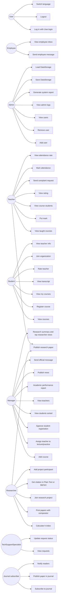
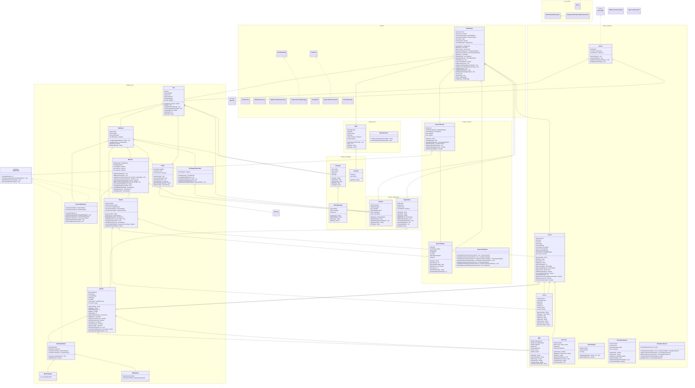

# Diagrams

## Use Case Diagram

```mermaid
flowchart LR
    UserActor((User))
    EmployeeActor((Employee))
    AdminActor((Admin))
    TeacherActor((Teacher))
    StudentActor((Student))
    ManagerActor((Manager))
    SupportActor((TechSupportSpecialist))
    ResearcherActor((Researcher))
    JournalReader((Journal subscriber))

    Login[Log in with User.login]
    Logout[Logout]
    SwitchLanguage[Switch language]

    SendMessage[Send employee message]
    ViewInbox[View employee inbox]

    AddUser[Add user]
    RemoveUser[Remove user]
    ViewUsers[View users]
    ViewLogs[View admin logs]
    SystemReport[Generate system report]
    SaveData[Save DataStorage]
    LoadData[Load DataStorage]

    ViewTeacherCourses[View taught courses]
    PutMark[Put mark]
    ViewCourseStudents[View course students]
    PublishPaper[Publish research paper]
    ViewTeacherRating[View rating]
    SendComplaint[Send complaint request]
    MarkAttendance[Mark attendance]
    ViewAttendanceRate[View attendance rate]

    ViewCourses[View courses]
    RegisterCourse[Register course]
    ViewMyCourses[View my courses]
    ViewTranscript[View transcript]
    RateTeacher[Rate teacher]
    JoinOrganization[Join organization]
    ViewTeacherInfo[View teacher info]

    AddCourse[Add course]
    AssignTeacher[Assign teacher to lecture/practice]
    ApproveRegistration[Approve student registration]
    ViewStudentsSorted[View students sorted]
    ViewTeachers[View teachers]
    AcademicReport[Academic performance report]
    PublishNews[Publish news]
    SendOfficialMessage[Send official message]
    ResearchSummary[Research summary and top researcher news]

    ViewRequests[View requests]
    UpdateRequest[Update request status]

    CalculateHIndex[Calculate h-index]
    PrintPapers[Print papers with comparator]
    JoinProject[Join research project]
    Citation[Get citation in Plain Text or BibTeX]
    AddParticipant[Add project participant]

    SubscribeJournal[Subscribe to journal]
    PublishJournalPaper[Publish paper in journal]
    NotifyReaders[Notify readers]

    UserActor --> Login
    UserActor --> Logout
    UserActor --> SwitchLanguage

    EmployeeActor --> SendMessage
    EmployeeActor --> ViewInbox

    AdminActor --> AddUser
    AdminActor --> RemoveUser
    AdminActor --> ViewUsers
    AdminActor --> ViewLogs
    AdminActor --> SystemReport
    AdminActor --> SaveData
    AdminActor --> LoadData

    TeacherActor --> ViewTeacherCourses
    TeacherActor --> PutMark
    TeacherActor --> ViewCourseStudents
    TeacherActor --> PublishPaper
    TeacherActor --> ViewTeacherRating
    TeacherActor --> SendComplaint
    TeacherActor --> MarkAttendance
    TeacherActor --> ViewAttendanceRate

    StudentActor --> ViewCourses
    StudentActor --> RegisterCourse
    StudentActor --> ViewMyCourses
    StudentActor --> ViewTranscript
    StudentActor --> RateTeacher
    StudentActor --> JoinOrganization
    StudentActor --> ViewTeacherInfo

    ManagerActor --> AddCourse
    ManagerActor --> AssignTeacher
    ManagerActor --> ApproveRegistration
    ManagerActor --> ViewStudentsSorted
    ManagerActor --> ViewTeachers
    ManagerActor --> AcademicReport
    ManagerActor --> PublishNews
    ManagerActor --> SendOfficialMessage
    ManagerActor --> ResearchSummary

    SupportActor --> ViewRequests
    SupportActor --> UpdateRequest

    ResearcherActor --> CalculateHIndex
    ResearcherActor --> PrintPapers
    ResearcherActor --> PublishPaper
    ResearcherActor --> JoinProject
    ResearcherActor --> Citation
    ResearcherActor --> AddParticipant

    JournalReader --> SubscribeJournal
    JournalReader --> PublishJournalPaper
    JournalReader --> NotifyReaders
```

## Class Diagram

```mermaid
classDiagram
    namespace models_users {
        class User {
            -String id
            -String fullName
            -String email
            -String password
            -String language
            -boolean loggedIn
            +login(String, String) boolean
            +logout() void
            +changePassword(String) void
            +switchLanguage(Language) void
            +equals(Object) boolean
            +hashCode() int
            +toString() String
        }

        class Employee {
            -double salary
            -Date hireDate
            -String employeeId
            -List~Message~ messages
            +sendMessage(Employee, String) void
            +viewMessages() List~Message~
            +getSalary() double
            +getEmployeeId() String
        }

        class Admin {
            -List~String~ logFiles
            -List~User~ users
            -List~UserLog~ userLogs
            +addUser(User) void
            +removeUser(String) void
            +updateUser(User) void
            +viewLogFiles() List~String~
            +generateSystemReport() String
            +getUserLogs() List~UserLog~
        }

        class Student {
            -String studentId
            -String major
            -int yearOfStudy
            -double gpa
            -int credits
            -List~Course~ enrolledCourses
            -List~Mark~ marks
            +getStudentId() String
            +getMajor() String
            +getYearOfStudy() int
            +getGpa() double
            +getCredits() int
            +getEnrolledCourses() List~Course~
            +getMarks() List~Mark~
            +registerCourse(Course) boolean
            +dropCourse(Course) boolean
            +viewMarks() List~Mark~
            +viewTranscript() Transcript
            +getTranscript() Transcript
            +rateTeacher(Teacher, int) void
            +viewTeacherInfo(Course, LessonType) String
            +joinOrganization(Organization) void
        }

        class GraduateStudent {
            -String thesisTitle
            -Researcher supervisor
            -List~ResearchPaper~ publishedPapers
            -List~ResearchProject~ researchProjects
            +setSupervisor(Researcher) void
            +defendThesis() boolean
        }

        class MasterStudent {
            -int courseWorkCredits
        }

        class PhDStudent {
            -String dissertationTopic
            -List~ResearchPaper~ publicationsRequired
        }

        class Teacher {
            -String teacherId
            -TeacherPosition position
            -List~Course~ taughtCourses
            -List~ResearchPaper~ researchPapers
            -List~ResearchProject~ researchProjects
            +getTeacherId() String
            +getPosition() TeacherPosition
            +getTaughtCourses() List~Course~
            +putMark(Student, Course, Mark) void
            +manageCourse(Course) void
            +viewStudents(Course) List~Student~
            +sendComplaint(Student, UrgencyLevel, String) Request
            +viewStudentInfo(Student) String
        }

        class Manager {
            -ManagerType managerType
            -String department
            -List~Student~ students
            -List~Teacher~ teachers
            -List~Request~ requests
            +addStudent(Student) void
            +addTeacher(Teacher) void
            +assignCourseToTeacher(Course, Teacher, LessonType) void
            +assignCourseToTeacher(Course, Teacher) void
            +approveRegistration(Student, Course) boolean
            +addCourseForRegistration(Course, int, String) void
            +generateStatisticalReport() Report
            +manageNews(News, String) void
            +viewAllStudents(SortBy) List~Student~
            +viewAllTeachers() List~Teacher~
            +viewRequests() List~Request~
        }

        class TechSupportSpecialist {
            -List~Request~ requests
            +viewRequests() List~Request~
            +acceptRequest(Request) void
            +rejectRequest(Request, String) void
            +markRequestDone(Request) void
            +updateRequestStatus(Request, RequestStatus) void
        }

        class ResearchEmployee {
            -List~ResearchPaper~ researchPapers
            -List~ResearchProject~ researchProjects
            +calculateHIndex() int
            +printPapers(Comparator~ResearchPaper~) void
            +getResearchProjects() List~ResearchProject~
            +getResearchPapers() List~ResearchPaper~
            +publishPaper(ResearchPaper) void
            +joinProject(ResearchProject) void
        }
    }

    namespace models_academic {
        class Course {
            -String courseId
            -String title
            -int credits
            -String major
            -int yearOfStudy
            -CourseType courseType
            -Teacher lectureTeacher
            -Teacher practiceTeacher
            -List~Student~ enrolledStudents
            -List~Lesson~ lessons
            +getCourseId() String
            +getTitle() String
            +getCredits() int
            +getMajor() String
            +getYearOfStudy() int
            +getCourseType() CourseType
            +getEnrolledStudents() List~Student~
            +getLessons() List~Lesson~
            +addStudent(Student) boolean
            +removeStudent(Student) boolean
            +getAvailableSeats() int
            +getTeacherForLessonType(LessonType) Teacher
            +addLesson(Lesson) boolean
            +removeLesson(Lesson) boolean
        }

        class Lesson {
            -String lessonId
            -LessonType type
            -Date date
            -String time
            -String room
            -Course course
            -Teacher teacher
            +getLessonId() String
            +getType() LessonType
            +getDate() Date
            +getTime() String
            +getRoom() String
            +getCourse() Course
            +getTeacher() Teacher
            +getLessonInfo() String
        }

        class Mark {
            -double firstAttestation
            -double secondAttestation
            -double finalExam
            -double total
            -String letterGrade
            -Course course
            -Student student
            +getTotal() double
            +getLetterGrade() String
            +getCourse() Course
            +getStudent() Student
            +calculateTotal() double
            +calculateLetterGrade() String
        }

        class Transcript {
            -Student student
            -Map~Course, Mark~ marks
            -double gpa
            -Date generatedDate
            +getStudent() Student
            +getMarks() Map~Course, Mark~
            +getGpa() double
            +getGeneratedDate() Date
            +addMark(Course, Mark) void
            +calculateGPA() double
            +printTranscript() void
        }

        class TeacherRating {
            -Student student
            -Teacher teacher
            -int rating
            +addRating(Student, Teacher, int) void
            +getRating(Teacher) double
        }

        class AttendanceRecord {
            -Student student
            -Lesson lesson
            -AttendanceStatus status
            -Date recordedAt
            +getStudent() Student
            +getLesson() Lesson
            +getStatus() AttendanceStatus
            +getRecordedAt() Date
            +updateStatus(AttendanceStatus) void
            +countsAsAttended() boolean
        }

        class AttendanceService {
            -List~AttendanceRecord~ records
            +markAttendance(Student, Lesson, AttendanceStatus) AttendanceRecord
            +getRecordsForStudent(Student) List~AttendanceRecord~
            +getRecordsForLesson(Lesson) List~AttendanceRecord~
            +calculateAttendanceRate(Student) double
            +getAllRecords() List~AttendanceRecord~
        }

        class Journal {
            -String name
            -List~User~ subscribers
            -List~Observer~ observers
            +subscribe(User) void
            +unsubscribe(User) void
            +publishPaper(ResearchPaper) void
            +notifyObservers(String) void
        }
    }

    namespace models_research {
        class ResearchPaper {
            -String title
            -List~String~ authors
            -String journal
            -int citations
            -int pages
            -Date publicationDate
            -String doi
            +getTitle() String
            +getCitations() int
            +getPublicationDate() Date
            +getAuthors() List~String~
            +getPages() int
            +getCitation(Format) String
            +compareTo(ResearchPaper) int
        }

        class ResearchProject {
            -String topic
            -List~ResearchPaper~ publishedPapers
            -List~Researcher~ participants
            -Date startDate
            -Date endDate
            +getTopic() String
            +setTopic(String) void
            +getPublishedPapers() List~ResearchPaper~
            +getParticipants() List~Researcher~
            +addPaper(ResearchPaper) void
            +addParticipant(Researcher) boolean
            +addParticipant(Object) boolean
        }

        class ResearchAnalytics {
            +topCitedResearchers(List~Researcher~, int) List~Researcher~
            +papersByYear(List~ResearchPaper~, int) List~ResearchPaper~
            +sortPapers(List~ResearchPaper~, Comparator~ResearchPaper~) List~ResearchPaper~
            +printPapers(List~ResearchPaper~, Comparator~ResearchPaper~) void
            +allResearchPapers(List~Researcher~) List~ResearchPaper~
            +printAllResearchPapers(List~Researcher~, Comparator~ResearchPaper~) void
            +topCitedResearcherOfYear(List~Researcher~, int) Researcher
        }
    }

    namespace models_news {
        class News {
            -NewsType type
            -String title
            -String content
            -Date date
            -List~Comment~ comments
            -boolean pinned
            +addComment(Comment) void
            +pin() void
            +getTitle() String
            +toString() String
        }

        class NewsGenerator {
            +createFromPaper(ResearchPaper) News
            +createTopResearcherNews(User) News
        }
    }

    namespace models_messaging {
        class Message {
            -User sender
            -User receiver
            -String text
            -Date date
            +getText() String
            +getSender() User
            +getReceiver() User
            +getDate() Date
            +toString() String
        }

        class OfficialMessage {
            -String subject
            -Date eventDate
            -String room
            +getSubject() String
            +getEventDate() Date
            +getRoom() String
            +toString() String
        }

        class Comment {
            -String text
            -User author
            +getText() String
        }

    }

    namespace models_organization {
        class Request {
            -String requestId
            -String description
            -User requester
            -RequestStatus status
            -Date createdDate
            -Date resolvedDate
            +getStatus() RequestStatus
            +getRequestId() String
            +updateStatus(RequestStatus) void
            +getRequestInfo() String
            +toString() String
        }

        class Organization {
            -String orgId
            -String name
            -Student head
            -List~Student~ members
            +getOrgId() String
            +getName() String
            +getHead() Student
            +getMembers() List~Student~
            +addMember(Student) void
            +removeMember(Student) void
            +electHead(Student) void
            +setHead(Student) void
            +toString() String
        }

    }

    namespace root_models {
        class Report
        class AbstractReportGenerator
        class AcademicPerformanceReportGenerator
    }

    namespace patterns {
        class DataStorage {
            -List~User~ users
            -List~Course~ courses
            -List~ResearchPaper~ researchPapers
            -List~ResearchProject~ researchProjects
            -List~News~ news
            -List~Request~ requests
            -List~Organization~ organizations
            +getInstance() DataStorage
            +getUsers() List~User~
            +getCourses() List~Course~
            +getResearchPapers() List~ResearchPaper~
            +getResearchProjects() List~ResearchProject~
            +getNews() List~News~
            +getRequests() List~Request~
            +getOrganizations() List~Organization~
            +addUser(User) void
            +removeUser(String) boolean
            +addCourse(Course) void
            +addResearchPaper(ResearchPaper) void
            +addResearchProject(ResearchProject) void
            +addNews(News) void
            +addRequest(Request) void
            +addOrganization(Organization) void
            +save() void
            +save(String) void
            +load() DataStorage
            +load(String) DataStorage
        }

        class NewsFactory
        class PaperNewsFactory
        class TopResearcherNewsFactory
        class SortingStrategy
        class ComparatorSortingStrategy
        class SortingUtils
        class Command
        class RequestStatusCommand
        class CommandInvoker
    }

    class Researcher {
        <<interface>>
        +calculateHIndex() int
        +printPapers(Comparator~ResearchPaper~) void
        +publishPaper(ResearchPaper) void
        +joinProject(ResearchProject) void
    }

    class Observer {
        <<interface>>
    }
    class Observable {
        <<interface>>
    }

    class UserLog
    class NotResearcherException
    class SupervisorException

    User <|-- Employee
    User <|-- Student
    Employee <|-- Admin
    Employee <|-- Teacher
    Employee <|-- Manager
    Employee <|-- TechSupportSpecialist
    Employee <|-- ResearchEmployee
    Student <|-- GraduateStudent
    GraduateStudent <|-- MasterStudent
    GraduateStudent <|-- PhDStudent
    Message <|-- OfficialMessage

    Researcher <|.. Teacher
    Researcher <|.. GraduateStudent
    Researcher <|.. ResearchEmployee
    Observable <|.. Journal
    SortingStrategy <|.. ComparatorSortingStrategy
    Command <|.. RequestStatusCommand
    AbstractReportGenerator <|-- AcademicPerformanceReportGenerator

    Employee "1" o-- "*" Message
    Admin "1" o-- "*" User
    Admin "1" o-- "*" UserLog
    Manager "1" o-- "*" Student
    Manager "1" o-- "*" Teacher
    Manager "1" o-- "*" Request
    TechSupportSpecialist "1" o-- "*" Request
    Teacher "1" o-- "*" Course
    Teacher "1" o-- "*" ResearchPaper
    Student "1" o-- "*" Course
    Student "1" o-- "*" Mark
    Course "1" o-- "*" Student
    Course "1" o-- "*" Lesson
    Lesson "*" --> "1" Course
    Lesson "*" --> "1" Teacher
    Mark "*" --> "1" Course
    Mark "*" --> "1" Student
    ResearchProject "1" o-- "*" ResearchPaper
    ResearchProject "1" o-- "*" Researcher
    News "1" o-- "*" Comment
    Journal "1" o-- "*" User
    Journal "1" o-- "*" Observer
    Message "*" --> "1" User
    Request "*" --> "1" User
    Organization "1" o-- "*" Student
    DataStorage "1" o-- "*" User
    DataStorage "1" o-- "*" Course
    DataStorage "1" o-- "*" ResearchPaper
    DataStorage "1" o-- "*" ResearchProject
    DataStorage "1" o-- "*" News
    DataStorage "1" o-- "*" Request
    DataStorage "1" o-- "*" Organization
```
